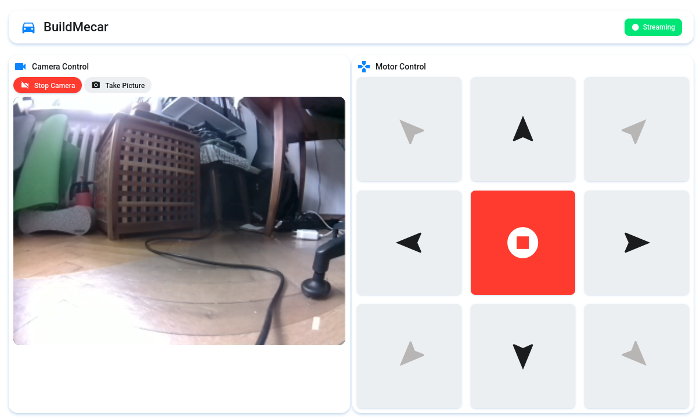

# BuildMecar - Smart Robot with Mecanum Wheels

A smart building block robot with Mecanum wheels, based on Raspberry Pi Build HAT. This project provides web-based control interface for the BuildMecar Kit with optional camera streaming support.

## Overview

BuildMecar is a smart robot built with building blocks featuring:
- **Mecanum Wheels**: Enables lateral movement and spinning in place
- **Raspberry Pi Build HAT**: Controls motors and sensors via LPF2 connectors
- **Web Interface**: Browser-based control panel for remote operation
- **Camera Support**: Optional 5MP camera with live streaming
- **Modular Design**: Built with blocks for easy customization

## Features

- **Omnidirectional Movement**: Move forward, backward, sideways, and diagonally
- **Web Control Interface**: Easy-to-use browser-based control panel
- **Live Camera Streaming**: Optional camera feed in the web interface
- **Battery Powered**: High discharge coefficient Li-ion batteries
- **Customizable**: Built with blocks - create your unique robot design
- **Systemd Service**: Run as a background service on Raspberry Pi

## Hardware Requirements

- Raspberry Pi (3/4/Zero 2 W recommended)
- Raspberry Pi Build HAT
- 4× LEGO® Powered Up Motors (LPF2)
- Mecanum wheels set
- Li-ion battery pack (for motors)
- Optional: Raspberry Pi Camera Module (5MP)
- BuildMecar building blocks kit

### Motor Connection

Connect motors to Build HAT ports according to this configuration. The configuration can be changed later:

| Build HAT Port | Motor Position | Wheel Direction |
|----------------|----------------|-----------------|
| PORT A         | Right Front    | R               |
| PORT B         | Left Front     | L               |
| PORT C         | Left Rear      | R               |
| PORT D         | Right Rear     | L               |

> **Important**: Connect the camera while the system is powered off to prevent damage.

## Software Installation

### Quick Start with Pre-built Image

The easiest way to get started is using the official pre-built image:

1. Download the [BuildMecar image](https://drive.google.com/file/d/1uOoRIsYQvvnr9v_s6ZARcFsb6UODwuWt/view?usp=sharing)
2. Write the image to a Micro SD card (16GB+ recommended) using [Win32DiskImager](https://files.waveshare.com/upload/7/76/Win32DiskImager.zip)
3. Insert the SD card and power on your Raspberry Pi

### Manual Installation

If you prefer to set up from scratch:

#### 1. Prerequisites

```bash
# Update system
sudo apt-get update
sudo apt-get upgrade -y

# Install required system packages
sudo apt-get install unzip git -y
```

#### 2. Enable UART and Camera

```bash
sudo raspi-config
```

- Navigate to **Interfacing Options → Serial**
  - Disable shell access
  - Enable hardware serial port
- Navigate to **Interfacing Options → Camera**
  - Enable camera interface
- Reboot the system

#### 3. Install Python Dependencies

```bash
# Clone the repository
cd ~
git clone https://github.com/LudwikBielczynski/buildme-car.git
cd buildme-car

# Install uv (modern Python package manager)
curl -LsSf https://astral.sh/uv/install.sh | sh


# Install project dependencies
make install
```

## Usage

### Running Manually

#### Start the Web Server

```bash
cd ~/buildme-car
make run-server
```

The server will start on port 5002. Access the web interface at:
```
http://<raspberry-pi-ip>:5002
```



The web interface provides an intuitive Material Design control panel with:
- **Camera Control Panel**: Toggle camera streaming and capture photos
- **Live Video Feed**: Real-time camera stream display when enabled
- **Motor Control Grid**: 3x3 directional pad for omnidirectional movement
- **Status Indicators**: Real-time camera streaming status
- **Touch-Optimized**: Responsive design works on both desktop and mobile devices

#### Test Motors

To test individual motors:

```bash
make test-motors
```

This will cycle through all four motors (A, B, C, D) and gradually increase speed.

### Running as a System Service

To run BuildMecar automatically on boot:

```bash
# Install the systemd service
make service-install

# Start the service
sudo systemctl start buildmecar

# Check service status
make service-status

# View live logs
make service-logs

# Restart the service
make service-restart
```

To remove the service:

```bash
make service-uninstall
```

### Web Interface Controls

Once the web server is running:

1. Open a web browser
2. Navigate to `http://<raspberry-pi-ip>:5002`
3. Use the control buttons:
   - **Arrow buttons**: Directional movement (forward, backward, left, right)
   - **Diagonal buttons**: Combined movements (front-left, front-right, etc.)
   - **Stop button**: Emergency stop
   - **Camera toggle**: Enable/disable camera streaming (if camera is connected)
   - **Take Picture**: Capture and save a photo

## Network Configuration

### Configure WiFi (Headless Setup)

If setting up without a display:

1. Create `wpa_supplicant.conf` in the boot partition:

```bash
ctrl_interface=DIR=/var/run/wpa_supplicant GROUP=netdev
country=US
update_config=1

network={
    ssid="Your_WiFi_SSID"
    psk="Your_WiFi_Password"
}
```

2. For SSH access, create an empty file named `ssh` in the boot partition

### Finding Your Raspberry Pi IP

#### Method 1: Using the pre-built image
```bash
ssh pi@BuildMecar
```
Default password: `raspberry`

#### Method 2: Using IP scanner
Use [Advanced IP Scanner](https://www.advanced-ip-scanner.com/) to find devices with "Raspberry Pi" in the manufacturer field.

#### Method 3: Direct IP
```bash
ssh pi@192.168.x.x
```

## Project Structure

```
BuildMecar-code/
├── src/
│   └── buildmecar/
│       ├── main.py           # Flask web server and main application
│       ├── car.py            # Car control logic and motor management
│       ├── camera_pi.py      # Camera handling and streaming
│       ├── base_camera.py    # Base camera class
│       ├── test_motors.py    # Motor testing utility
│       ├── templates/
│       │   └── index.jinja   # Web interface template
│       └── static/
│           └── style.css     # Web interface styling
├── services/
│   └── buildmecar.service    # Systemd service configuration
├── tests/                    # Unit tests
├── Makefile                  # Build and deployment commands
├── pyproject.toml           # Project configuration and dependencies
└── README.md                # This file
```

## Development

### Available Make Commands

```bash
make install          # Install all dependencies
make update          # Update code from git repository
make run-server      # Run the web server manually
make test-motors     # Test motor functionality
make service-install # Install systemd service
make service-uninstall # Remove systemd service
make service-restart # Restart the service
make service-status  # Check service status
make service-logs    # View service logs
```

### Running Tests

```bash
uv run pytest
```

### Code Quality

The project uses Ruff for linting and formatting:

```bash
uv run ruff check .
uv run ruff format .
```

## API Endpoints

The web server provides the following REST API endpoints:

- `GET /` - Main web interface
- `POST /cmd` - Send movement commands
- `GET /video_feed` - Camera streaming (if enabled)
- `POST /toggle_camera` - Enable/disable camera
- `GET /camera_status` - Get camera status

### Command Format

Send POST requests to `/cmd` with form data:

```json
{
  "id": "ic-up"  // Command ID
}
```

Available command IDs:
- `ic-up`: Move forward
- `ic-down`: Move backward
- `ic-left`: Move left
- `ic-right`: Move right
- `ic-left-up`: Move diagonally front-left
- `ic-right-up`: Move diagonally front-right
- `ic-left-down`: Move diagonally rear-left
- `ic-right-down`: Move diagonally rear-right
- `ic-stop`: Stop all motors
- `take-picture`: Capture a photo

## Safety Notices

**Important Safety Information**:

- Power off the system before connecting/disconnecting the camera
- Use only the provided Li-ion battery for motor power
- Do not reverse battery polarity when charging or discharging
- Use quality chargers from reputable manufacturers
- Do not mix old and new batteries
- Replace batteries after 2 years or when they reach max cycle life
- Keep batteries away from flammable materials and out of reach of children
- Lithium batteries can cause fire or injury if mishandled

## Troubleshooting

### Motors Not Running

1. Ensure the battery is properly connected and charged
2. Check motor connections to the correct Build HAT ports
3. Verify Build HAT is properly seated on Raspberry Pi GPIO pins
4. Run `make test-motors` to test individual motors

### Camera Not Working

1. Ensure camera is properly connected to the camera port
2. Verify camera is enabled in `raspi-config`
3. Check `/dev/video0` exists: `ls /dev/video*`
4. Review camera logs in the web server output

### Web Interface Not Accessible

1. Check the server is running: `make service-status`
2. Verify the IP address: `hostname -I`
3. Ensure firewall allows port 5002
4. Check logs: `make service-logs`

### Service Won't Start

1. Check service status: `sudo systemctl status buildmecar`
2. View detailed logs: `sudo journalctl -u buildmecar -n 50`
3. Verify user paths in `services/buildmecar.service`
4. Ensure all dependencies are installed: `make install`

## Resources

### Documentation

- [BuildMecar Assembly Drawing](https://files.waveshare.com/upload/0/BuildMecar-Assemblydrawing.pdf)
- [Raspberry Pi Build HAT Brief](https://files.waveshare.com/upload/f/f8/Raspberry-pi-build-hat-product-brief.pdf)
- [Build HAT Getting Started Guide](https://files.waveshare.com/upload/9/97/Getting-started-build-hat.pdf)
- [Build HAT Serial Protocol](https://files.waveshare.com/upload/e/ed/Build-hat-serial-protocol.pdf)
- [Build HAT Python Library](https://files.waveshare.com/upload/5/5a/Build-hat-python-library.pdf)

### Official Resources

- [Waveshare BuildMecar Kit Product Page](https://www.waveshare.com/buildmecar-kit.htm)
- [Waveshare BuildMecar Wiki](https://www.waveshare.com/wiki/BuildMecar-Kit)
- [Official Example Code](https://files.waveshare.com/upload/a/ad/BuildMecar-code.zip)

## Technical Specifications

- **Platform**: Raspberry Pi with Build HAT
- **Motors**: 4× LEGO® Powered Up LPF2 Motors
- **Control Interface**: Web-based (Flask)
- **Camera**: Optional Raspberry Pi Camera Module (5MP)
- **Power**: Li-ion battery pack
- **Connectivity**: WiFi (built-in Raspberry Pi WiFi)
- **Programming Language**: Python 3.12+
- **Web Framework**: Flask 3.1.2+

## License

This project is provided as-is for use with the Waveshare BuildMecar Kit.

## Support

For technical support:
- Visit [Waveshare Support](https://service.waveshare.com/)
- Check the [Waveshare Wiki](https://www.waveshare.com/wiki/BuildMecar-Kit)
- Submit issues on the project repository

**Working Hours**: 9 AM - 6 PM GMT+8 (Monday to Friday)

## Acknowledgments

Based on the Waveshare BuildMecar Kit and powered by:
- Raspberry Pi Build HAT
- LEGO® Powered Up system
- Flask web framework
- Python buildhat library
